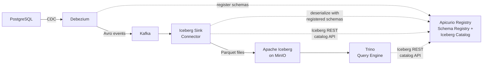

# From Database to Lakehouse in Real-Time: CDC, Kafka, Apicurio, and Apache Iceberg

A live demonstration of a **real-time CDC-to-lakehouse pipeline** using open-source tools: [Debezium](https://debezium.io/), [Apache Kafka](https://kafka.apache.org/), [Apicurio Registry](https://www.apicur.io/registry/) (CNCF sandbox), and [Apache Iceberg](https://iceberg.apache.org/).

Presented at **JavaZone 2026**, **Community Over Code Asia 2026**.

## Overview

Batch ETL runs nightly. Your analysts query stale data. Your ML models train on yesterday's features. This demo replaces all of that with a single, real-time pipeline — built entirely with open-source tools:

- **Debezium** captures row-level changes from PostgreSQL via CDC
- **Kafka** streams the events with schemas enforced by **Apicurio Registry**
- **Apicurio Registry** serves double duty: **schema registry** for Avro governance AND **Iceberg REST catalog** for table metadata — one component governing the entire pipeline
- **Apache Iceberg** stores the data in an open table format, queryable within seconds via **Trino**
- **Schema evolution** propagates automatically from database through registry to lakehouse — no manual DDL

## Architecture



### Pipeline Flow

1. **Change Data Capture** — Debezium reads the PostgreSQL WAL and publishes row-level change events to Kafka topics
2. **Schema Governance** — Avro schemas are automatically registered in Apicurio Registry, with compatibility rules preventing breaking changes
3. **Lakehouse Ingestion** — The Iceberg sink connector deserializes events using registry schemas and writes Parquet files to MinIO, with table metadata managed by Apicurio's Iceberg REST catalog API
4. **Real-Time Queries** — Trino queries Iceberg tables via Apicurio Registry's Iceberg REST catalog — data is available within seconds of the database commit

## Prerequisites

- Docker and Docker Compose
- `curl` and `jq`

## Quick Start

```bash
# Start all services (PostgreSQL, Kafka, Apicurio Registry, Kafka Connect, MinIO, Trino)
docker compose up -d --build

# Wait for all services to be healthy
./scripts/wait-for-services.sh

# Deploy the Debezium source and Iceberg sink connectors
./scripts/02-deploy-connectors.sh

# Insert data and query it in Iceberg
./scripts/03-insert-data.sh
sleep 10
./scripts/04-query-iceberg.sh

# Or run the full interactive demo end-to-end
./scripts/run-demo.sh
```

## Demo Scripts

| Script | Purpose |
|--------|---------|
| `scripts/01-start-pipeline.sh` | Start all Docker Compose services and wait for health |
| `scripts/02-deploy-connectors.sh` | Register Debezium source + Iceberg sink connectors via Kafka Connect REST API |
| `scripts/03-insert-data.sh` | Insert a new customer and order into PostgreSQL |
| `scripts/04-query-iceberg.sh` | Query Iceberg tables via Trino — see CDC data arrive in real-time |
| `scripts/05-schema-evolution.sh` | Add a column in PostgreSQL, watch it propagate automatically through Registry to Iceberg |
| `scripts/06-time-travel.sh` | Query historical snapshots in Iceberg — see data as it was at any point in time |
| `scripts/run-demo.sh` | Run all demo steps interactively with pauses |
| `scripts/wait-for-services.sh` | Wait for all services to be healthy |
| `scripts/cleanup.sh` | Tear down all containers and volumes |

## Web UIs

| UI | URL | Description |
|----|-----|-------------|
| **Registry UI** | http://localhost:8888 | Browse Avro schemas registered by Debezium — see versions, compatibility rules |
| **Iceberg Catalog** | http://localhost:8080/apis/iceberg/v1/config | Apicurio Registry's Iceberg REST catalog endpoint |
| **MinIO Console** | http://localhost:9001 | Browse Iceberg Parquet files in the warehouse bucket (admin/password) |
| **Trino** | http://localhost:8084 | SQL query interface for Iceberg tables |

## Key Concepts

### Why CDC Instead of Batch ETL?

| Approach | Latency | Schema Changes | Infrastructure |
|----------|---------|----------------|----------------|
| Nightly batch ETL | Hours | Manual DDL sync | ETL scheduler + staging tables |
| **CDC + Iceberg** | **Seconds** | **Automatic propagation** | **Streaming pipeline** |

### Schema Evolution Flow

When you `ALTER TABLE` in PostgreSQL:

1. **Debezium** detects the schema change from the WAL
2. **Apicurio Registry** registers a new Avro schema version (BACKWARD compatible)
3. **Iceberg sink** reads the new schema from the registry and evolves the Iceberg table DDL automatically

No manual intervention. No broken pipelines. No stale schemas.

### Iceberg Time Travel

Every CDC commit creates an Iceberg snapshot. You can query historical data:

```sql
-- See all snapshots
SELECT snapshot_id, committed_at FROM iceberg.lakehouse."customers$snapshots";

-- Query data as it was before a change
SELECT * FROM iceberg.lakehouse.customers FOR VERSION AS OF <snapshot_id>;
```

Useful for ML training on historical features, auditing, and debugging production issues.

## Technology Stack

| Component | Technology | Role |
|-----------|------------|------|
| Source Database | [PostgreSQL 16](https://www.postgresql.org/) | Transactional database with logical replication |
| Change Data Capture | [Debezium 3.5](https://debezium.io/) | Reads PostgreSQL WAL, publishes CDC events |
| Event Streaming | [Apache Kafka](https://kafka.apache.org/) (KRaft, 3-node cluster) | Durable event log between source and sink |
| Schema Registry + Iceberg Catalog | [Apicurio Registry 3.x](https://www.apicur.io/registry/) (CNCF sandbox) | Avro schema governance AND Iceberg REST catalog in one component |
| Lakehouse Sink | [Iceberg Kafka Connect](https://github.com/tabular-io/iceberg-kafka-connect) | Writes Kafka events to Iceberg tables |
| Table Format | [Apache Iceberg](https://iceberg.apache.org/) | Open table format with time travel and schema evolution |
| Object Storage | [MinIO](https://min.io/) | S3-compatible storage for Iceberg data files |
| Query Engine | [Trino 439](https://trino.io/) | SQL queries over Iceberg tables |

## Kubernetes Deployment

For production-like deployment on Kubernetes with Strimzi, see the `k8s/` directory:

- `k8s/01-minio.yaml` — MinIO deployment and service
- `k8s/02-iceberg-sink-connector.yaml` — KafkaConnector CR for Strimzi
- `k8s/03-trino.yaml` — Trino deployment with Iceberg catalog

## License

Apache License 2.0 — see [LICENSE](LICENSE).
